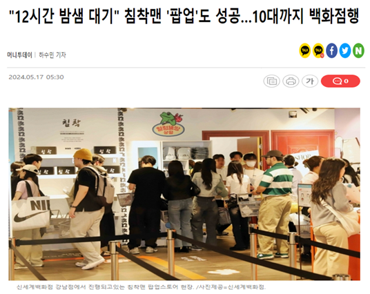
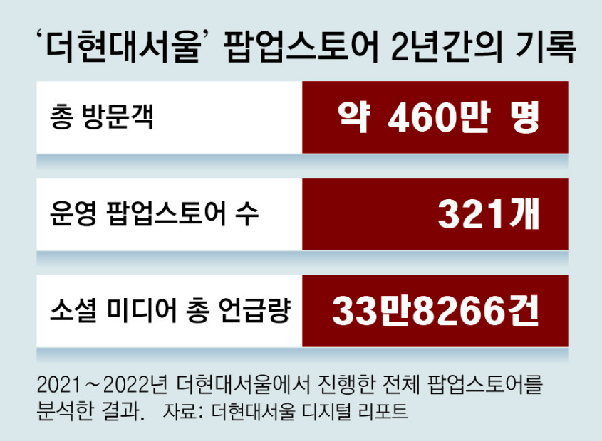

<!-- 제목 -->

  

<!-- 배너 -->

    <!--  -->
    

<!-- 홈페이지 링크 -->

	<h3>
	    🌐 ZIPPOP 사이트
	    <a href="https://www.sabujaks-irs.kro.kr/">https://www.sabujaks-irs.kro.kr</a>
	</h3>

 

## 👩🏻‍💻‍ FIIIIIVE 팀원

||||||
|:-:|:-:|:-:|:-:|:-:|
|<a href="https://github.com/seongxun">👑박성준</a>|<a href="https://github.com/hyejeung">강혜정</a>|<a href="https://github.com/mpqm">박종성</a>|<a href="https://github.com/NakyungSong">송나경</a>|<a href="https://github.com/yeoxxy">정수연</a>|

 

## 👨🏻‍🏫 프로젝트 개요

	
<b> 📋 프로젝트 소개</b>

    <ul>
        <li>
            최근 화장품이나 의류를 넘어 드라마, 음악, 게임, 영화, 애니메이션 등 상관없이 각 업계에서 팝업스토어를 활용하고 있다.  
            <strong>팝업스토어에서는 기존 매장과의 차별점을 두기 위해 한정판 굿즈를 판매</strong>하기 때문에, 
            이를 구매하기 위해 <strong>장시간 대기하는 현상이 급증하는 추세</strong>다.
        </li>
         
        <li>
            <strong>🏠ZIP_POP 이 제공하는 서비스</strong> 
            사전예약을 통해 기존의 팝업스토어 대기 시스템을 개선하고 밤샘 대기 또는 장시간 대기로 인한 고객과 해당 팝업 주변 거주민의 불편을 해소 
            매장 입성에 성공했음에도 재고 소진 등의 이유로 원하는 물품을 구하지 못하는 상황을 방지할 수 있도록 사전예약자에 한 해 굿즈를 선구매
        </li>
         
        <li>
            예약 기능 없이 정보 제공을 목적으로 하는 유사 사이트와 달리, <strong>🏠ZIP_POP</strong>은 하나의 사이트에서 <strong>팝업스토어와 관련된 정보 파악뿐만 아니라 예약 및 굿즈 구매까지 가능하다는 차별점</strong>이 있다.
        </li>
    </ul>

 

	
<b> 💡 프로젝트 배경</b>

    <ul>
        <li>
             
대학원생 한지선씨(30)는 인기 유튜버 '침착맨'의 팝업스토어에 방문하기 위해 치열한 예약 경쟁을 뚫었다. 침착맨 팬 커뮤니티에서 예약 팁도 전수받았지만 "인기 상품이 모두 품절돼 아쉬워 아침 일찍 다시 방문해 볼까 생각 중이다"라고 말했다.
 
            

                 
                <a>https://news.mt.co.kr/mtview.php?no=2024051609573785999</a>
            

        </li>
         
        <li>
            
더현대서울은 2021년 2월 개점 후 2023년 11월 중순까지 약 460회의 팝업스토어를 운영했다. 이틀에 한 개꼴로 새로운 팝업스토어를 연 셈이다.  ‘임시 매장’의 이미지였던 팝업스토어가 ‘한정판 전문 매장’으로 진화했다고 본다. 운영 기간 제한이라는 팝업스토어의 특징이 ‘이때 아니면 못 산다’는 인식을 주게 되었다.
 
            

                 
                <a>https://www.donga.com/news/Economy/article/all/20231201/122446644/1</a>
            

        </li>
    </ul>

 

	
<b> 🌱 프로젝트 v2 시작</b>

    <ul>
        <li> 전 프로젝트는 끝났지만 미구현한 기능 및 프론트엔드가 미완성되어있었습니다.</li>
         
        <li> 부실한 문서들을 개발문서들을 정리하고, GithubAction CICD를 추가해 시작했습니다.</li>
         
        <li> 이에 리프레쉬 토큰 및 대기열을 추가한 프로젝트 v2를 개인으로 구성하고 시작했습니다.</li>
         
    </ul>

 

## 💻 기술 스택
| **Category**       | **Skills**                                                                                                                                                                                                                                               |
|--------------------|-----------------------------------------------------------------------------------------------------------------------------------------------------------------------------------------------------------------------------------------------------------|
| **Frontend**       |      |
| **Backend**        |    |
| **Database**       |                               |
| **Collaboration**  |    |
| **CI/CD**          |                                                                                                                                             |

 

## 🎡 ERD & Architecture

    

 

## 🗄️ v2 개발 문서 및 링크
| **문서**              | **링크**                                                                                                                                                              |
|---------------------|---------------------------------------------------------------------------------------------------------------------------------------------------------------------|
| 🎡 ERD & 아키텍처       | [ERD & 아키텍처 ](https://github.com/mpqm/spring-service-zippop/wiki/v2%E2%80%901.-ERD-&-%EC%95%84%ED%82%A4%ED%85%8D%EC%B2%98)                                                    |
| ➰ 요구사항 정의서          | [요구사항 정의서](https://docs.google.com/spreadsheets/d/1Oy9dhMyVrUTMVNd5EqTX9RuNqQDUb2-Y/edit?usp=sharing&ouid=117935972514311680024&rtpof=true&sd=true)                 |
| 📃 백엔드 API 명세서      | [백엔드 API 명세서](https://jazzy-bumper-d95.notion.site/ZIPPOP-API-b8578829d1b140a6825b8880aa47e5ee)                                                                     |
| ✔️ 백엔드 기능 테스트       | [백엔드 기능 테스트](https://github.com/mpqm/spring-service-zippop/wiki/v2%E2%80%904-%EB%B0%B1%EC%97%94%EB%93%9C-%EA%B8%B0%EB%8A%A5-%ED%85%8C%EC%8A%A4%ED%8A%B8)            |
| 🌱 프론트엔드 화면설계서      | [프론트엔드 화면설계서](https://www.figma.com/design/Lsk0T0J6oH3GSzmzInUJPZ/%ED%99%94%EB%A9%B4%EC%84%A4%EA%B3%84%EC%84%9C?node-id=0-1&t=lKoGim9PCwtw4xTA-0)                   |
| 🎥 프론트엔드 시연 영상      | [프론트엔드 시연 영상](https://github.com/mpqm/spring-service-zippop/wiki/v2%E2%80%906.-%ED%94%84%EB%A1%A0%ED%8A%B8%EC%97%94%EB%93%9C-%EC%8B%9C%EC%97%B0-%EC%98%81%EC%83%81) |
| 🔎 기능 및 성능 개선       | [기능 및 성능 개선](https://github.com/mpqm/spring-service-zippop/wiki/v2%E2%80%907.-%EA%B8%B0%EB%8A%A5-%EB%B0%8F-%EC%84%B1%EB%8A%A5-%EA%B0%9C%EC%84%A0)                   |
| 🔎 핵심 기능 설명         | [핵심 기능 설명](https://github.com/mpqm/spring-service-zippop/wiki/v2%E2%80%908.-%ED%95%B5%EC%8B%AC-%EA%B8%B0%EB%8A%A5-%EC%84%A4%EB%AA%85)                               |
| 🖥️ CICD 프로세스       | [CICD 프로세스](https://github.com/mpqm/spring-service-zippop/wiki/v2%E2%80%909.-CICD-%EA%B3%BC%EC%A0%95)                                                               |
| 🔗 컨벤션              | [컨벤션](https://github.com/mpqm/spring-service-zippop/wiki/v2%E2%80%9099.-%EC%BB%A8%EB%B2%A4%EC%85%98)                                                                |
| 📖 v1 개발문서          | [v1 개발문서](https://github.com/mpqm/spring-service-zippop/wiki)                                                                                                       |
| 📖 v1 설계 프로젝트 링크    | [v1 초기 설계 프로젝트 링크](https://github.com/beyond-sw-camp/be06-1st-FIIIIIVE-ZIP_POP)                                                                                     |
| 📖 v1 백엔드 프로젝트 링크   | [v1 백엔드 프로젝트 링크](https://github.com/beyond-sw-camp/be06-2nd-FIIIIIVE-ZIP_POP)                                                                                       |
| 📖 v1 프론트엔드 프로젝트 링크 | [v1 프론트엔드 프로젝트 링크](https://github.com/beyond-sw-camp/be06-3rd-FIIIIIVE-ZIP_POP)                                                                                     |

