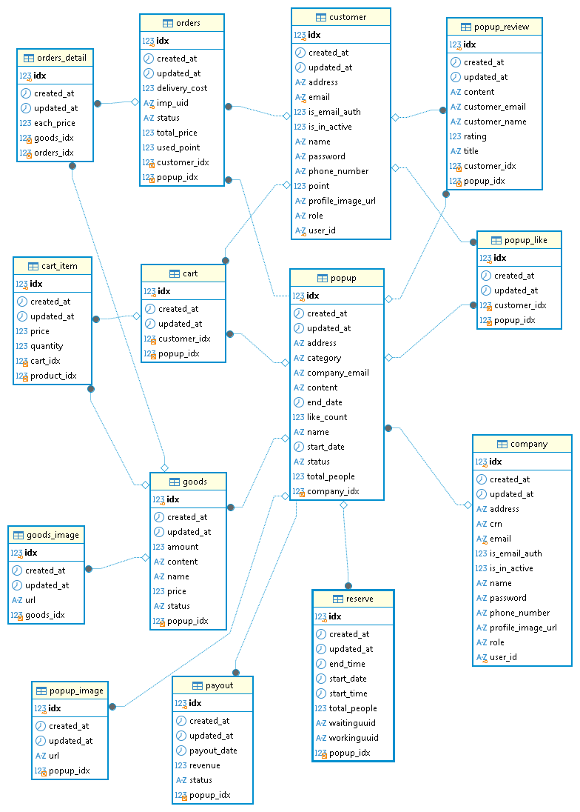

# ERD & 아키텍처

## ERD

## 시스템 아키텍처

## 소프트웨어 아키텍처

### 레이어드 아키텍처

초기 개발 단계에서 발생할 수 있는 실수를 최소화하고 안정적으로 개발하기 위해, 팀원들에게 익숙한 레이어드 아키텍처를 채택했습니다. 이를 통해 프로젝트를 빠르고 효율적으로 진행하고자 했습니다.

#### 단일 시스템 구축

레이어드 아키텍처를 적용하면 초기부터 복잡한 분산 시스템을 구축하지 않고도 하나의 애플리케이션에서 트래픽을 모니터링하고 분석할 수 있습니다.

추후 확장이 필요한 경우에만 특정 서비스를 분리할 수 있도록 구성했습니다.

#### 제한된 배포 환경에서의 효율성

단일 서버 또는 소수의 서버만으로도 효율적으로 운영할 수 있어 제한된 배포 환경에서도 원활하게 동작할 수 있습니다.

#### 기능 및 데이터 관리의 효율성

ZIP_POP은 다양한 기능과 데이터를 관리하므로 각 계층을 분리하고 역할을 명확하게 정의하는 것이 중요합니다.

레이어드 아키텍처를 통해 각 계층의 독립성을 유지함으로써 사용자 인터페이스 개선과 요구사항 변경에 빠르게 대응할 수 있습니다.

#### 코드 가독성과 로직 재사용성

계층별 책임을 명확하게 분리하여 코드의 가독성과 로직의 재사용성을 높였습니다. 또한 코드의 일관성과 모듈화를 촉진하여 유지보수가 쉽도록 구성했습니다.

#### 향후 확장 계획

우선 레이어드 아키텍처를 기반으로 개발하고, 향후 시스템 확장이나 서버 증설에 따라 계층 간 결합도를 낮출 필요가 있을 경우 헥사고날 아키텍처 기반으로 리팩터링할 예정입니다.

  

## 프로젝트 구조

### 도메인형 패키지 구조

기능과 관련된 클래스를 직관적으로 찾을 수 있고, 도메인별 응집도를 높여 모듈 간 경계를 명확하게 구분할 수 있다는 장점 때문에 도메인형 패키지 구조를 선택했습니다.

### 공통 패키지

서비스 전반에서 공통으로 사용하는 클래스는 `global` 패키지에서 관리합니다.

