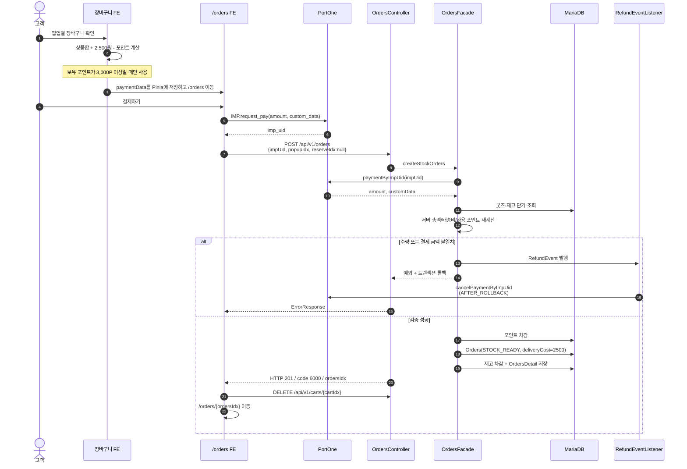
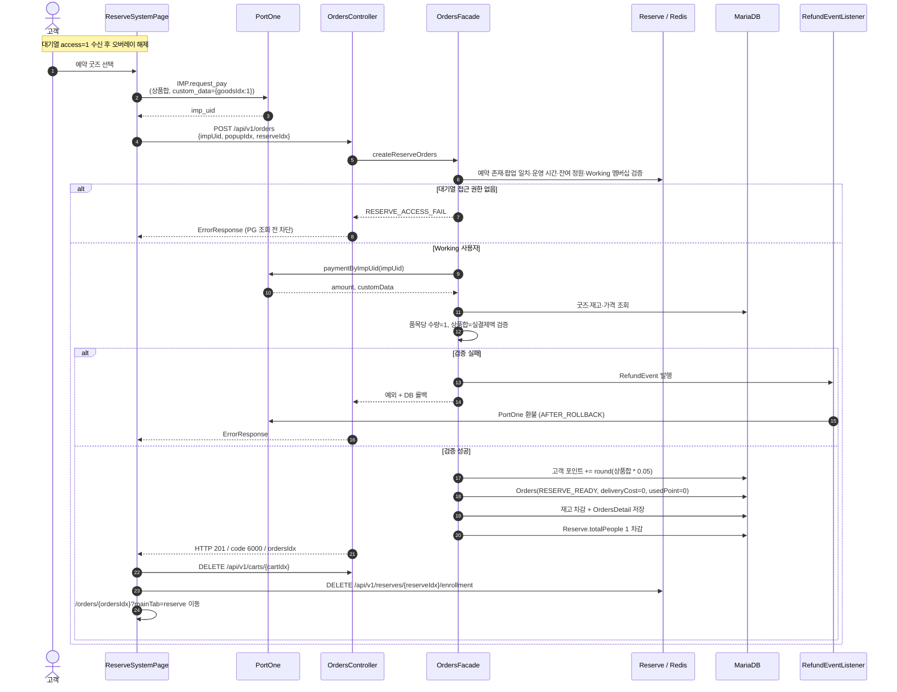
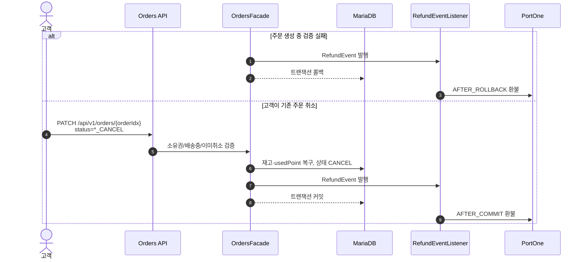
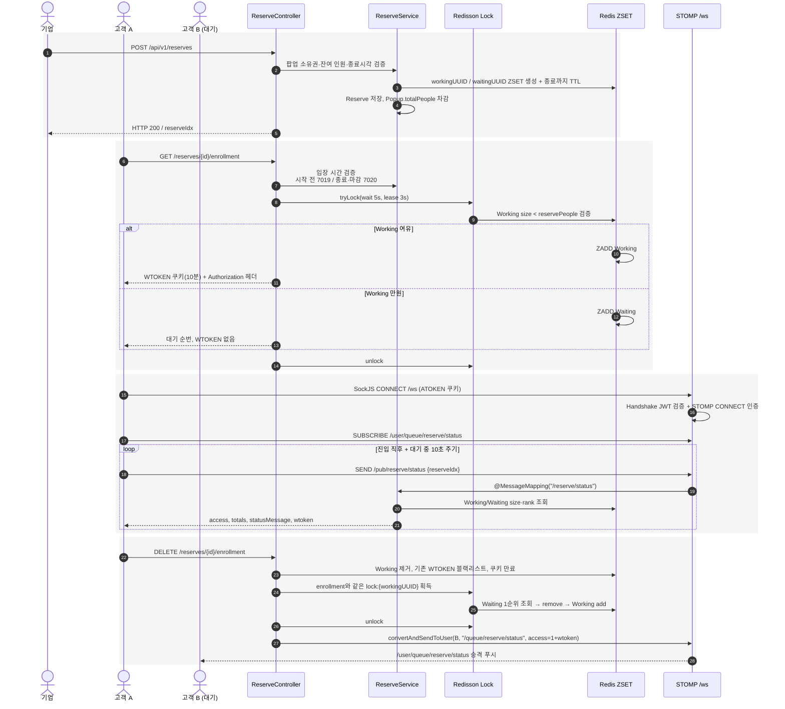
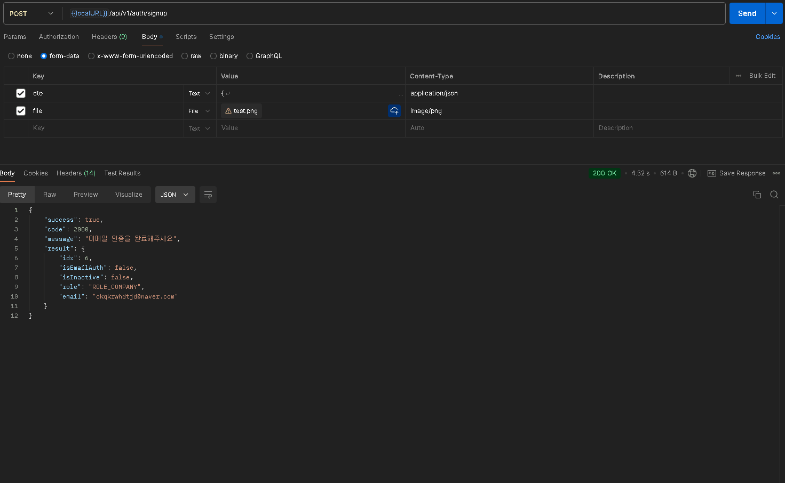
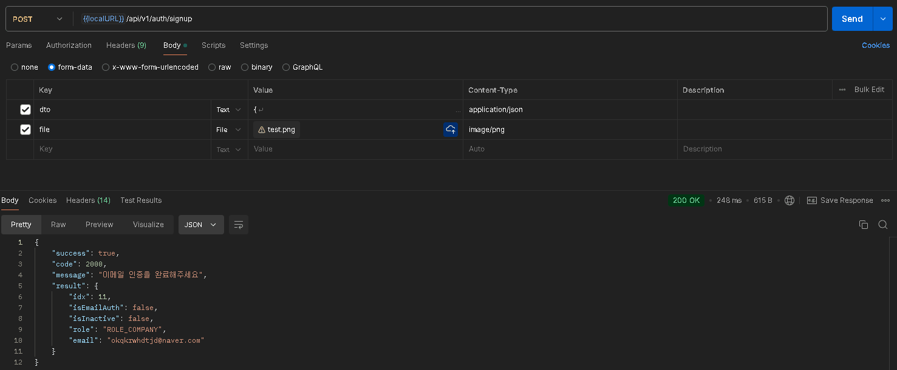
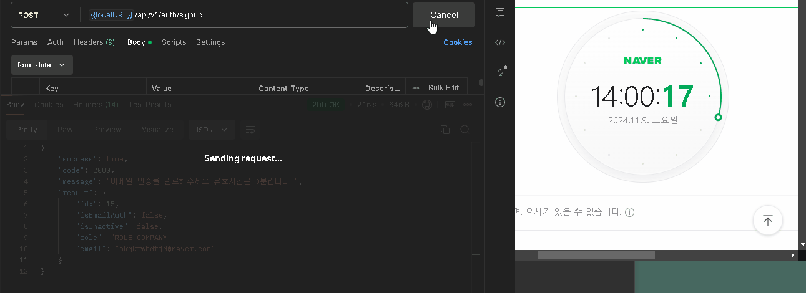
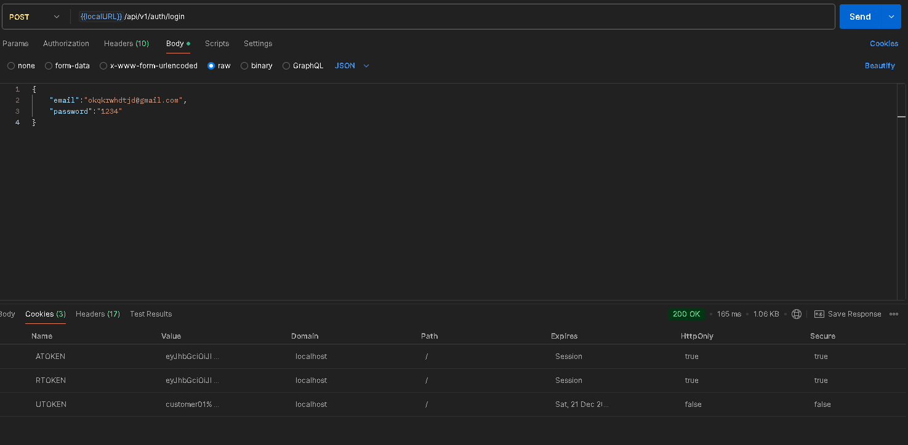
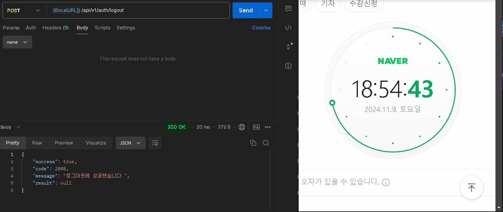

# ZIPPOP 기능 설명 및 개선

## 결제·예약 상세 흐름

> 기준일: 2026-08-02  
> `OrdersFacade`/`OrdersService`, `RefundEventListener`, `ReserveService`, `RedisQueueService`, WebSocket 설정과 Vue 예약/결제 페이지를 대조한 **검증 완료 AS-IS 흐름**입니다.  
> 단위 테스트와 Docker 실환경의 3사용자 대기열 시나리오를 기준으로, 현재 보장과 외부 연동 잔여 위험을 구분합니다.

---

## 1. 재고 굿즈 결제

종료된 팝업의 남은 재고를 온라인으로 판매하는 흐름입니다. 장바구니는 팝업 단위로 생성되며, 프론트가 주문 요약을 Pinia에 저장한 뒤 `/orders`로 이동합니다.



| 항목 | 현재 서버 규칙 |
| --- | --- |
| 결제 분기 | `reserveIdx == null` |
| 배송비 | 2,500원 |
| 포인트 사용 | 보유 3,000P 이상, 사용량은 상품합 한도 |
| 포인트 적립 | 재고 주문에는 없음. FE도 적립 안내 없이 3,000P 이상 사용 조건만 표시 |
| 초기 상태 | `STOCK_READY` |

---

## 2. 예약 굿즈 결제

대기열의 Working 구간에 진입한 고객이 예약 굿즈를 현장 수령 조건으로 결제하는 흐름입니다.



| 항목 | 현재 서버 규칙 |
| --- | --- |
| 결제 분기 | `reserveIdx != null` |
| 수량 | 굿즈별 정확히 1개 |
| 배송비 / 수령 | 0원 / 현장 수령 |
| 포인트 | 사용 불가, 상품합 5% 적립 |
| 초기 상태 | `RESERVE_READY` |
| 자리 반환 | FE가 주문 성공 후 enrollment DELETE를 별도 호출 |

### 결제 검증 실패와 일반 주문 취소의 차이



`RefundEvent.rollbackOnly`로 생성 실패(`AFTER_ROLLBACK`)와 정상 취소(`AFTER_COMMIT`)를 분기합니다. 단, `AFTER_COMMIT` 이후 PortOne 호출이 실패하면 이미 커밋된 주문을 자동 재시도하지 않으므로 운영 단계에서는 outbox/재시도 또는 환불 상태 머신이 필요합니다.

---

## 3. 예약 대기열·승격·WebSocket

Redis ZSET 두 개를 예약 슬롯별로 두고 시간순으로 운영합니다. STOMP 브로커 prefix는 `/sub`, `/queue`, 사용자 prefix는 `/user`이며 실제 사용자 구독 경로는 `/user/queue/reserve/status`입니다.

- Working: 굿즈 선택·결제 화면에 진입한 사용자
- Waiting: Working 정원 초과 후 승격을 기다리는 사용자
- score: 등록 시각 millisecond



### access 상태

| access | 의미 | FE 동작 |
| --- | --- | --- |
| 0 | Waiting | 대기 오버레이 유지 |
| 1 | Working | 오버레이 해제, 굿즈 선택·결제 |
| 2 | 예약 종료 시간 경과 | 안내 후 홈으로 이동 |
| 3 | `Reserve.totalPeople <= 0` 마감 | 안내 후 홈으로 이동 |

### 이탈 경로

| 경로 | 처리 |
| --- | --- |
| 예약 취소 버튼 | STOMP disconnect 후 enrollment DELETE |
| `beforeunload` | `keepalive` DELETE |
| Vue Router guard | 예약 흐름 이탈 시 confirm 후 DELETE |
| WebSocket DisconnectHandler | 당일 예약을 순회해 첫 번째 해당 큐에서 제거·승격 |
| 결제 성공 | 장바구니 삭제 후 enrollment DELETE |

---

## 4. 검증 결과

| 검증 범위 | 결과 | 확인 내용 |
| --- | --- | --- |
| 백엔드 단위·컨텍스트 테스트 | 통과 | 26개: 요청 검증, 장바구니 중복, 좋아요 삭제, 리뷰 자격, 예약 시간/큐 복구, 주문·환불, 로그아웃, 미존재 경로 404 포함 |
| 프론트엔드 단위 테스트 | 통과 | 41개: API 계약, 오류 처리, 라우터 메인 탭, Pinia 전체 스토어 엔드포인트 |
| 정적·번들 검증 | 통과 | ESLint, Vue production build |
| Docker 서비스 | 통과 | MariaDB·Redis healthcheck, backend healthy, frontend 기동 |
| 공개 API smoke | 통과 | 팝업·재고 굿즈·예약 목록 HTTP 200 |
| 공개·고객·기업 읽기 API smoke | 통과 | 팝업/굿즈 상세, 리뷰/예약, 계정/장바구니/주문/좋아요, 기업 정산 등 15/15 HTTP 200 |
| 실제 쓰기 CRUD | 통과 | 팝업·굿즈·예약 생성/수정/삭제, 좋아요 왕복 토글, 장바구니 생성·중복 차단·수량·삭제 18/18 |
| 3사용자 실제 대기열 | 통과 | 시작 전 400, 등록 200/200/200, Working/Waiting `2/1`, 취소 후 `2/0`, 첫 대기자 승격 확인 |
| 실제 WebSocket 사용자 푸시 | 통과 | 인증 STOMP 연결 후 `/user/queue/reserve/status`에서 승격 `access=1`과 WTOKEN 수신 |

대기열 검증은 테스트 예약을 생성해 두 차례 재현했고 매 실행 후 DELETE 200으로 제거하여 팝업 정원을 복구했습니다. CRUD용 데이터도 API 삭제 후 소프트 삭제된 테스트 팝업 행만 식별자를 검증해 물리 정리했습니다. PortOne 실결제/실환불은 외부 샌드박스 거래를 만들지 않고 `IamportClient` mock 기반 계약 테스트로 검증했습니다.

---

## 5. 현재 보장과 잔여 과제

| 우선순위 | 현재 구현 | 위험 | 권장 방향 |
| --- | --- | --- | --- |
| P1 | 일반 취소는 `AFTER_COMMIT`, 생성 실패는 `AFTER_ROLLBACK`으로 환불 | 커밋 후 외부 PG 장애 시 자동 재시도 없음 | outbox + 멱등 재시도 또는 `REFUND_PENDING` 상태 도입 |
| P1 | 승격과 신규 등록이 같은 Redisson 락을 사용 | 락 내부 ZSET 이동은 여러 Redis 명령이라 프로세스 중단 지점에 부분 적용 가능 | Lua 스크립트로 remove/add를 단일 원자 연산화 |
| P1 | WebSocket disconnect 즉시 큐 제거·승격 | 일시적인 네트워크 끊김에도 사용자가 자리를 잃을 수 있음 | 재접속 유예 시간과 heartbeat 기반 만료 정책 도입 |
| P2 | WTOKEN/JWT 만료와 블랙리스트 TTL을 10분으로 통일 | 설정값이 여러 호출부에 분산 | 공통 Duration 설정으로 단일화 |
| P2 | 스케줄러가 누락된 당일 큐를 DB 기준으로 복구 | 서버 중단 중 소실된 큐 멤버 순서는 복원 불가 | 필요 시 큐 이벤트 영속화 또는 Redis AOF 운영 정책 명시 |

수정 완료된 항목은 예약 주문의 Working 멤버십 서버 검증, 표준 `/user/queue/reserve/status` 구독과 `/queue/reserve/status` 발행, 승격 공용 락, disconnect의 무관한 신규 토큰 블랙리스트 제거, WTOKEN 10분 통일, 누락 큐 복구 조건, 두 큐 미가입 사용자의 명시적 `RESERVE_ACCESS_FAIL` 처리입니다.

---

## 6. 전체 흐름 요약

```text
[기업] 팝업·예약 슬롯·굿즈 등록
          │
          └── Redis Working / Waiting 큐 (슬롯별 TTL)
                    │
[고객] enrollment ─────► Working 또는 Waiting
                    │           │
               STOMP 상태      └── access=1 ► 예약 굿즈 결제
                    │                              │
        이탈/결제 성공 ─────────────────┘
                    │
             Waiting 1순위 승격 + 유저 소켓 푸시

[재고 마켓] 장바구니 ► /orders ► PortOne ► 서버 재검증 ► STOCK_READY
[예약 굿즈] access=1 ► PortOne ► 서버 재검증 ► RESERVE_READY ► 자리 반환
```

포트폴리오의 핵심은 **Redis ZSET 이중 큐, 등록·승격을 직렬화하는 Redisson 락, STOMP 유저 푸시, 서버 측 Working 인가, PG 결제 재검증, 트랜잭션 결과에 따른 보상 환불**입니다. 현재 핵심 흐름은 테스트로 확인됐으며, 운영 전에는 외부 PG 실패 재시도와 Redis 이동의 완전 원자화를 보강하는 것이 우선입니다.

## 구현상 주의사항

| 영역 | 현재 구현 | 영향 |
| --- | --- | --- |
| 성공 코드 | 6015, 7008 등 Enum 코드가 중복되고 기업 예약 목록이 취소 메시지를 사용 | 소비자는 `code`만으로 세부 행위를 구분하지 말 것 |
| 대기자 승격 | enrollment·승격은 같은 Redisson 락을 사용하지만 waiting remove → working add는 여러 Redis 명령 | 프로세스 중단 시 부분 적용 가능하므로 Lua 원자화 권장 |
| 주문 취소 환불 | 정상 취소는 `AFTER_COMMIT`, 생성 실패는 `AFTER_ROLLBACK`에서 환불 | 커밋 후 PG 장애에 대한 outbox·멱등 재시도 없음 |
| 소켓 이탈 | DisconnectHandler가 즉시 큐 제거·다음 대기자를 승격 | 일시적 네트워크 단절에도 자리를 잃을 수 있어 재접속 유예 정책 권장 |
| Page 직렬화 | `PageImpl`을 직접 응답 | 외부 API 안정성을 위해 DTO/PagedModel 고정 권장 |

### 원본 검증 기록

- OpenAPI: 44 operations
- 백엔드 테스트: 26/26 통과
- 프론트엔드 테스트: 41/41 통과, ESLint·production build 통과
- Docker 읽기 API smoke: 15/15, 실제 쓰기 CRUD: 18/18 통과
- 3사용자 대기열: Working/Waiting `2/1` → 취소 후 `2/0`, 대기자 승격 확인
- 인증 STOMP: `/user/queue/reserve/status`에서 `access=1`과 WTOKEN 수신 확인
- PortOne 실결제/실환불, 이메일, S3는 외부 실연동 대신 mock·코드 계약으로 검증

## 검증 결과

- 백엔드 Gradle 테스트: 26개 테스트, 실패 0건
- API 엔드포인트: Controller·인증 필터·STOMP 매핑 기준 48개 항목
- 외부 프론트엔드/Docker/PG 검증 수치는 원본 기록으로 구분

---

# 회원 가입 성능 개선
- 동기 방식으로 이메일 전송 -> 비동기 방식의 이메일 전송으로 수정<br>
- 기존 방식 : 4s / 개선 방식 : 0.2s => 결과 : 95% 향상




# 레디스를 이용한 이메일 인증 유효시간 설정
- 기존의 이메일 인증 방식은 유효시간 설정 없이 링크만 클릭하면 인증되는 구조<br>
- 레디스를 이용해 만료시간(3분)을 설정



# 리프레시 토큰 도입 및 테스트
- 리프레시 토큰 발급 및 저장 확인 



- 액세스 토큰 만료 후 갱신 테스트 (만료시간 1분)




